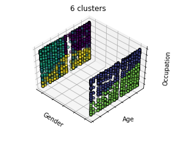
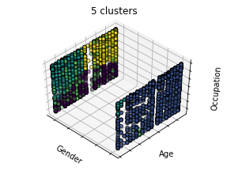
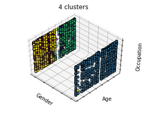
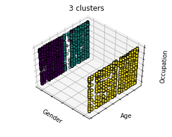
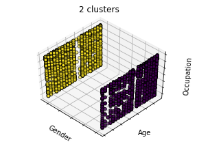
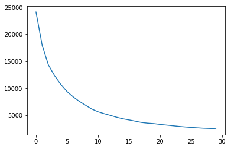
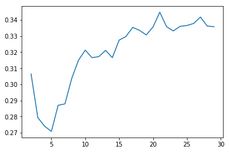
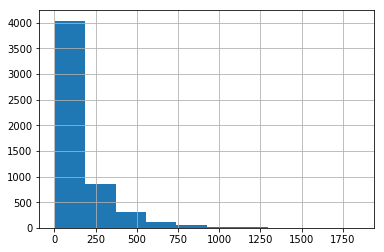

# Movie Recommender Case Study

The goal of this case study is to build a successful Movie Recommender Systems using Spark's Alternating Least Squares Model and the MovieLens dataset, which includes movie, user, and ratings data. Reccomender System's are traditionally difficult to evaluate. For each user, predicted ratings are generated, and the movies with the highest 5% of those ratings are recommended. The evaluation metric is the mean true ratings of the recommendations generated.


# The Cold Start
Movie Recommender Systems traditionally suffer from what is known as a cold start. New users and new movies are constantly added to movie platforms such as Netflix, and the Alternating Least Squares model is not equipped to make predictions for movies or users with no pre-existing data. In this case, there are more missing users than there are movies, so users will be clustered by demographic data to mitigate the cold start. 


# KMeans Clustering
User demographic data included User ID, Gender, Age, Occupation, and Zip Code. Features were normalized, and all were included in the final clustering













### Evaluate Num K


```python
number_k = []
for i in range(30):
    est = KMeans(i+1).fit(X)
    sse = -1*est.score(X)
    number_k.append(sse)
plt.plot(number_k)
```

The plot below shows the Sum of Squared Error as K increases




```python
sil= []
for i in range(2,30):
    est = KMeans(i).fit(X)
    labels = est.predict(X)
    sil_score = silhouette_score(X, labels)
    sil.append([i,sil_score])
sil = np.array(sil)
plt.plot(sil[:,0], sil[:,1])
```

The plot below shows the Silhouette Score as K increases. The silhouette score measures how similar an object is to its assigned cluster, compared to the other clusters.



As you can see form the silhouette score plot, 5 is the ideal number of clusters.

### KMeans with K = 5 to predict groups

```python
kmeans = KMeans(5).fit(X)
labels = kmeans.labels_
```

```python
user_groups.head()
```
<table border="1" class="dataframe">
  <thead>
    <tr style="text-align: right;">
      <th></th>
      <th>user</th>
      <th>cluster</th>
    </tr>
  </thead>
  <tbody>
    <tr>
      <th>0</th>
      <td>1</td>
      <td>3</td>
    </tr>
    <tr>
      <th>1</th>
      <td>2</td>
      <td>0</td>
    </tr>
    <tr>
      <th>2</th>
      <td>3</td>
      <td>1</td>
    </tr>
    <tr>
      <th>3</th>
      <td>4</td>
      <td>0</td>
    </tr>
    <tr>
      <th>4</th>
      <td>5</td>
      <td>1</td>
    </tr>
  </tbody>
</table>
</div>


# Fitting the Model


### Import KMeans Clustered User Groups and make recommendations by Cluster instead of by user


```
reco_instance = MovieRecommender()
fit_model = reco_instance.fit(clust_train)
```


```
clust_predictions = reco_instance.transform(clust_request,cluster=False)
clust_predictions.columns = ['movie', 'cluster', 'cluster_rating']
clust_predictions.to_pickle('data/predicted_cluster_ratings')
```


### Fill in missing user data with cluster ratings


```
users_wo_ratings = set(users.user.unique())-set(train_data.user.unique())
user_clusters = pd.merge(users, cluster_ratings, how='left', 
                         on='cluster').rename(
    columns={'cluster_rating':'rating'})
user_clusters.drop_duplicates(inplace=True)
```


```
train_data.user.value_counts().hist()
```





```
print('Mean: {}'.format(np.mean(train_data.user.value_counts())))
print('Median: {}'.format(np.median(train_data.user.value_counts())))
```

    Mean: 148.17558807186515
    Median: 86.0


Users on average have rated 148 movies each. However, the graph is skewed, so median is a better interpretation of the center of this distribution (multiple different values were later empirically tested, with little difference between them). 

### The following code fills in random ratings for new users based on the clusters they belong to

For each new user, they are assigned a cluster based on their demographic data, and 86 (the median) random ratings of the cluster they belong to are assigned to them. 


```
train_adjusted = train_data.copy()
for user in users_wo_ratings:
    mask = (user_clusters['user'] == user)
    subset = user_clusters.loc[mask,['movie','rating', 'user']]
    sample_from_subset = subset.sample(
        int(np.median(train_data.user.value_counts())))
    train_adjusted = pd.concat([train_adjusted, sample_from_subset])

```


```
len(train_data)
```


    800000


```
len(train_adjusted)
```


    855126


# Evaluate without clustered data


```
reco_instance = MovieRecommender()
fit_model = reco_instance.fit(train_data)
```

### Generate rating predictions


```
predictions_unclustered = reco_instance.transform(test_data, cluster=False)
rec_evaluator_unclustered = RecoRegressionEvaluation(
    labelCol="actualrating", predictionCol="rating")

rec_score_unclusted = rec_evaluator_unclustered.evaluate(
    predictions_unclustered)

print(rec_score_unclusted)
```

    evaluate based on: actualrating, predicted_rating
    3.649750743827708


# Evaluate model with clustered data

Look at 5% of most highly predicted movies for each user.
Return the average actual rating of those movies.

### Fit recommender model


```
reco_instance = MovieRecommender()
fit_model = reco_instance.fit(train_adjusted)
predictions = reco_instance.transform(test_data)
```

### Generate rating predictions


```
rec_evaluator = RecoRegressionEvaluation(labelCol="actualrating",
                                       predictionCol="rating")

rec_score = rec_evaluator.evaluate(predictions)

print(rec_score)
```

    evaluate based on: actualrating, rating
    4.292578849721707


