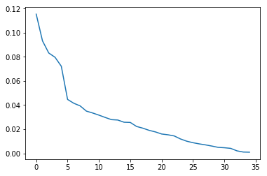
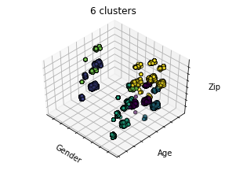
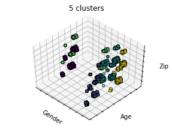
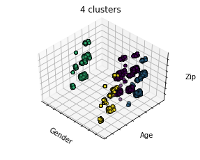
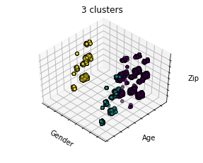
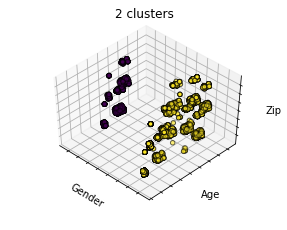
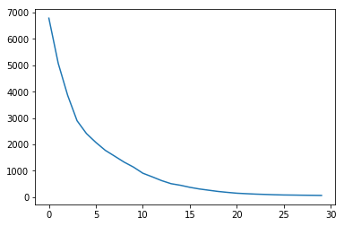
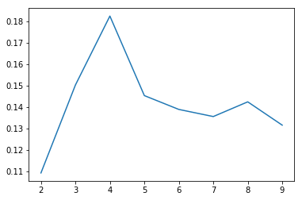

# Cluster User Demographic Data

```python
users = pd.read_csv('data/users.dat', sep='::', header=None)
users.columns = ['UserID','Gender','Age','Occupation','Zip']
#clean age
users.Age = users.Age.map({1:'1-18', 18:'18-25', 25:'25-35', 35:'35:45', 
               45:'45-56', 50:'45-56', 56:'56-older'})
users = pd.concat((users,pd.get_dummies(
     users.Age,drop_first=True)), axis=1)
users.drop('Age', axis=1, inplace=True)
#clean gender
users.Gender = users.Gender.map({'F':0, 'M':1})
#clean zip
users.Zip = users.Zip.str.slice(start=0, stop=1)
#users.Zip = users.Zip.astype('float64')
users = pd.concat((users,pd.get_dummies(users.Zip,drop_first=True, 
    prefix='zip')), axis=1)
users.drop('Zip', axis=1, inplace=True)

#clean occupation
users = pd.concat((users,pd.get_dummies(
     users.Occupation,drop_first=True, prefix='occ')), axis=1)
users.drop('Occupation', axis=1, inplace=True)

```


```python
users.head()
```
<div>
<table border="1" class="dataframe">
  <thead>
    <tr style="text-align: right;">
      <th></th>
      <th>UserID</th>
      <th>Gender</th>
      <th>18-25</th>
      <th>25-35</th>
      <th>35:45</th>
      <th>45-56</th>
      <th>56-older</th>
      <th>zip_1</th>
      <th>zip_2</th>
      <th>zip_3</th>
      <th>...</th>
      <th>occ_11</th>
      <th>occ_12</th>
      <th>occ_13</th>
      <th>occ_14</th>
      <th>occ_15</th>
      <th>occ_16</th>
      <th>occ_17</th>
      <th>occ_18</th>
      <th>occ_19</th>
      <th>occ_20</th>
    </tr>
  </thead>
  <tbody>
    <tr>
      <th>0</th>
      <td>1</td>
      <td>0</td>
      <td>0</td>
      <td>0</td>
      <td>0</td>
      <td>0</td>
      <td>0</td>
      <td>0</td>
      <td>0</td>
      <td>0</td>
      <td>...</td>
      <td>0</td>
      <td>0</td>
      <td>0</td>
      <td>0</td>
      <td>0</td>
      <td>0</td>
      <td>0</td>
      <td>0</td>
      <td>0</td>
      <td>0</td>
    </tr>
    <tr>
      <th>1</th>
      <td>2</td>
      <td>1</td>
      <td>0</td>
      <td>0</td>
      <td>0</td>
      <td>0</td>
      <td>1</td>
      <td>0</td>
      <td>0</td>
      <td>0</td>
      <td>...</td>
      <td>0</td>
      <td>0</td>
      <td>0</td>
      <td>0</td>
      <td>0</td>
      <td>1</td>
      <td>0</td>
      <td>0</td>
      <td>0</td>
      <td>0</td>
    </tr>
    <tr>
      <th>2</th>
      <td>3</td>
      <td>1</td>
      <td>0</td>
      <td>1</td>
      <td>0</td>
      <td>0</td>
      <td>0</td>
      <td>0</td>
      <td>0</td>
      <td>0</td>
      <td>...</td>
      <td>0</td>
      <td>0</td>
      <td>0</td>
      <td>0</td>
      <td>1</td>
      <td>0</td>
      <td>0</td>
      <td>0</td>
      <td>0</td>
      <td>0</td>
    </tr>
    <tr>
      <th>3</th>
      <td>4</td>
      <td>1</td>
      <td>0</td>
      <td>0</td>
      <td>0</td>
      <td>1</td>
      <td>0</td>
      <td>0</td>
      <td>0</td>
      <td>0</td>
      <td>...</td>
      <td>0</td>
      <td>0</td>
      <td>0</td>
      <td>0</td>
      <td>0</td>
      <td>0</td>
      <td>0</td>
      <td>0</td>
      <td>0</td>
      <td>0</td>
    </tr>
    <tr>
      <th>4</th>
      <td>5</td>
      <td>1</td>
      <td>0</td>
      <td>1</td>
      <td>0</td>
      <td>0</td>
      <td>0</td>
      <td>0</td>
      <td>0</td>
      <td>0</td>
      <td>...</td>
      <td>0</td>
      <td>0</td>
      <td>0</td>
      <td>0</td>
      <td>0</td>
      <td>0</td>
      <td>0</td>
      <td>0</td>
      <td>0</td>
      <td>1</td>
    </tr>
  </tbody>
</table>
<p>5 rows × 36 columns</p>
</div>


# Scatter Plot 3D


```python
estimators = [('8 clusters', KMeans(n_clusters=8)),
              ('6 clusters', KMeans(n_clusters=6)),
              ('5 clusters', KMeans(n_clusters=5)),
              ('4 clusters', KMeans(n_clusters=4)),
              ('3 clusters', KMeans(n_clusters=3)),
              ('2 clusters', KMeans(n_clusters=2))]

X = users.values
X = X[:,1:]
```


```python
from sklearn.decomposition import PCA
```


```python
pca = PCA()
pca.fit(X)
```


    PCA(copy=True, iterated_power='auto', n_components=None, random_state=None,
      svd_solver='auto', tol=0.0, whiten=False)


```python
plt.plot(pca.explained_variance_ratio_)
```


    [<matplotlib.lines.Line2D at 0x12f263908>]





```python
pca.explained_variance_ratio_[:7].sum()
```


    0.5294990303350828


```python
pca = PCA(n_components=5)
pca.fit(X)
x = pca.transform(X)
```


```python
fignum = 1
for name, est in estimators:
    fig = plt.figure(fignum, figsize=(4, 3))
    ax = Axes3D(fig, rect=[0, 0, .95, 1], elev=48, azim=134)
    est.fit(x)
    labels = est.labels_

    ax.scatter(x[:, 0], x[:, 1], x[:, 2],
               c=labels.astype(np.float), edgecolor='k')

    ax.w_xaxis.set_ticklabels([])
    ax.w_yaxis.set_ticklabels([])
    ax.w_zaxis.set_ticklabels([])
    ax.set_xlabel('Gender')
    ax.set_ylabel('Age')
    ax.set_zlabel('Zip')
    ax.set_title(name)
    ax.dist = 12
    fignum = fignum + 1

fig.show()
```

















# Evaluate Num K


```python
number_k = []
for i in range(30):
    est = KMeans(i+1).fit(x)
    sse = -1*est.score(x)
    number_k.append(sse)
plt.plot(number_k)
```


    [<matplotlib.lines.Line2D at 0x131a260b8>]





```python
sil= []
for i in range(2,10):
    est = KMeans(i).fit(x)
    labels = est.predict(x)
    sil_score = silhouette_score(X, labels)
    sil.append([i,sil_score])
sil = np.array(sil)
plt.plot(sil[:,0], sil[:,1])
```


    [<matplotlib.lines.Line2D at 0x13100db00>]





# KMeans with K = 4 to predict groups


```python
kmeans = KMeans(4).fit(X)
labels = kmeans.labels_
```


```python
user_groups = pd.DataFrame(labels,users.UserID.unique()).reset_index()
user_groups.columns = ['user', 'cluster']
```


```python
user_groups.to_csv('data/clustered_users.csv')
```


```python
user_groups.head()
```


<div>
<table border="1" class="dataframe">
  <thead>
    <tr style="text-align: right;">
      <th></th>
      <th>user</th>
      <th>cluster</th>
    </tr>
  </thead>
  <tbody>
    <tr>
      <th>0</th>
      <td>1</td>
      <td>3</td>
    </tr>
    <tr>
      <th>1</th>
      <td>2</td>
      <td>3</td>
    </tr>
    <tr>
      <th>2</th>
      <td>3</td>
      <td>2</td>
    </tr>
    <tr>
      <th>3</th>
      <td>4</td>
      <td>3</td>
    </tr>
    <tr>
      <th>4</th>
      <td>5</td>
      <td>2</td>
    </tr>
  </tbody>
</table>
</div>


# Recommender Case Study

**Imports and configuration**


```
import os
os.getcwd()
```


    '/Users/kylecaron/Desktop/movie_recommender/notebooks'


```
import os
os.chdir('..')
from src.util import *
from src.recommender import *
import pandas as pd
import numpy as np
import matplotlib.pyplot as plt
%matplotlib inline
import seaborn as sns
```

### Generate random sample and save train-test .csv files


```
os.getcwd()
```


    '/Users/kylecaron/Desktop/movie_recommender'


```
#generate_file_split(pd.read_csv('data/training.csv'),1)
```


```
# request_data = train_data.copy()
# request_data.drop('rating', axis=1, inplace=True)
# test_data = train_data.copy()
```


```
generate_file_split(random_subset(800000), 0.8)
```


```
train_data = pd.read_csv('data/ctrain.csv')
test_data = pd.read_csv('data/ctest.csv')
request_data = pd.read_csv('data/crequests.csv')
```

# Import KMeans Clustered User Groups and make recommendations by group instead of by user


```
users = pd.read_csv('data/clustered_users.csv')\
        .drop('Unnamed: 0', axis=1)
```


```
#train_set
clust_train = pd.merge(train_data, users, on='user', how='left')
clust_train = clust_train.drop('user', axis=1)
clust_train.columns = ['movie', 'rating', 'user']
clust_train.drop_duplicates(inplace=True)
#request set
clust_request = pd.merge(request_data, users, on='user', how='left')
clust_request = clust_request.drop('user', axis=1)
clust_request.columns = ['movie', 'user']
clust_request.drop_duplicates(inplace=True)
```


```
reco_instance = MovieRecommender()
fit_model = reco_instance.fit(clust_train)
```


```
clust_predictions = reco_instance.transform(clust_request,cluster=False)
clust_predictions.columns = ['movie', 'cluster', 'cluster_rating']

#adjust cluster predictions to fit similar distribution to training data
c2 = clust_predictions.copy()
#c2.cluster_rating = c2.cluster_rating.apply(lambda x: x+1 if x < 4 else np.ceil(x))
c2.cluster_rating = c2.cluster_rating.apply(lambda x: x+1 if x < 4 else np.ceil(x))
```


```
#ignore adjustment made above, made RMSE worse
clust_predictions.to_pickle('data/predicted_cluster_ratings')
```

# Evaluate by filling with clustered data


```
cluster_ratings = pd.read_pickle('data/predicted_cluster_ratings')
```


```
train_data = pd.read_csv('data/training.csv')
request_data = train_data.drop(['rating', 'timestamp'], axis=1)
test_data = pd.read_csv('data/testing.csv')
```


```
len(train_data.movie.unique())
```


    3662


```
len(set(test_data.movie.unique())- set(train_data.movie.unique()))
```


    44


In this current train-test-split, there are 44 movies in the test set not present in the training set

### Fill in missing user data with cluster ratings


```
users_wo_ratings = set(users.user.unique())-set(train_data.user.unique())
user_clusters = pd.merge(users, cluster_ratings, how='left', 
                         on='cluster').rename(
    columns={'cluster_rating':'rating'})
user_clusters.drop_duplicates(inplace=True)
```


```
train_data.user.value_counts().hist()
```


    <matplotlib.axes._subplots.AxesSubplot at 0x130262ac8>


```
print('Mean: {}'.format(np.mean(train_data.user.value_counts())))
print('Median: {}'.format(np.median(train_data.user.value_counts())))
```

    Mean: 148.17558807186515
    Median: 86.0


Users on average have rated 148 movies each. However, the graph is skewed, so median is a better interpretation of the center of this distribution.

### The following code fills in random ratings for new users based on the clusters they belong to

For each new user, they are assigned a cluster based on their demographic data, and 86 (the median) random ratings of the cluster they belong to are assigned to them.


```
train_adjusted = train_data.copy()
for user in users_wo_ratings:
    mask = (user_clusters['user'] == user)
    subset = user_clusters.loc[mask,['movie','rating', 'user']]
    sample_from_subset = subset.sample(
        int(np.median(train_data.user.value_counts())))
    train_adjusted = pd.concat([train_adjusted, sample_from_subset])

```

    /Users/kylecaron/anaconda3/lib/python3.6/site-packages/ipykernel_launcher.py:7: FutureWarning: Sorting because non-concatenation axis is not aligned. A future version
    of pandas will change to not sort by default.
    
    To accept the future behavior, pass 'sort=False'.
    
    To retain the current behavior and silence the warning, pass 'sort=True'.
    
      import sys


```
len(train_data)
```


    800000


```
len(train_adjusted)
```


    855126


# Evaluate without clustered data


```
from pyspark.ml.evaluation import RegressionEvaluator
from pyspark.ml.recommendation import ALS
```

### Fit recommender model


```
reco_instance = MovieRecommender()
fit_model = reco_instance.fit(train_data)
```

### Generate rating predictions


```
predictions_unclustered = reco_instance.transform(test_data, cluster=False)
```


```
rec_evaluator_unclustered = RecoRegressionEvaluation(
    labelCol="actualrating", predictionCol="rating")

rec_score_unclusted = rec_evaluator_unclustered.evaluate(
    predictions_unclustered)

print(rec_score_unclusted)
```

    3.649750743827708


# Evaluate model with clustered data

Look at 5% of most highly predicted movies for each user.
        Return the average actual rating of those movies.

### Fit recommender model


```
reco_instance = MovieRecommender()
fit_model = reco_instance.fit(train_adjusted)
predictions = reco_instance.transform(test_data)
```

### Generate rating predictions


```
rec_evaluator = RecoRegressionEvaluation(labelCol="actualrating",
                                       predictionCol="rating")

rec_score = rec_evaluator.evaluate(predictions)

print(rec_score)
```

    4.292578849721707


