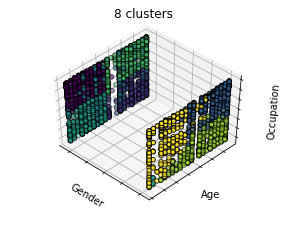
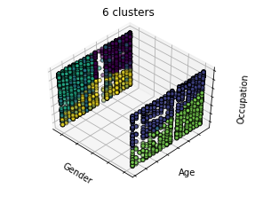
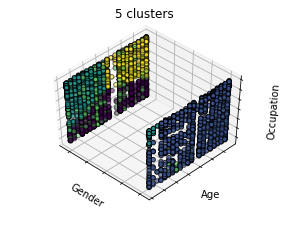
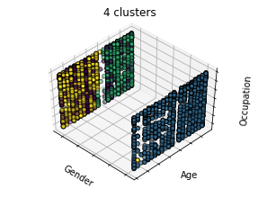
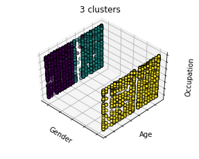
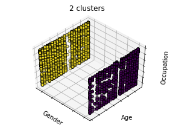
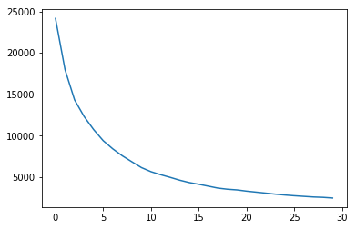
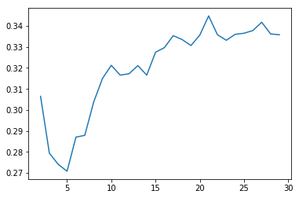

```python
from sklearn.cluster import KMeans
import os
os.chdir('..')
from src.util import *
from src.recommender import MovieRecommender
import pandas as pd
import numpy as np
import matplotlib.pyplot as plt
%matplotlib inline
import seaborn as sns
from mpl_toolkits.mplot3d import Axes3D
from sklearn.metrics import silhouette_score
from sklearn.preprocessing import StandardScaler
```


```python
os.getcwd()
```


    '/Users/kylecaron/Desktop/movie_recommender'


```python
users = pd.read_csv('data/users.dat', sep='::', header=None)
users.columns = ['UserID','Gender','Age','Occupation','Zip']
#clean
users.Zip = users.Zip.str.slice(0,5)
#users.Zip = users.Zip.str.slice(0,1)
users.Gender = users.Gender.map({'F':0, 'M':1})
users.Zip = users.Zip.astype('int64')
```

    /Users/kylecaron/anaconda3/lib/python3.6/site-packages/ipykernel_launcher.py:1: ParserWarning: Falling back to the 'python' engine because the 'c' engine does not support regex separators (separators > 1 char and different from '\s+' are interpreted as regex); you can avoid this warning by specifying engine='python'.
      """Entry point for launching an IPython kernel.


# Scatter Plot 3D


```python
estimators = [('8 clusters', KMeans(n_clusters=8)),
              ('6 clusters', KMeans(n_clusters=6)),
              ('5 clusters', KMeans(n_clusters=5)),
              ('4 clusters', KMeans(n_clusters=4)),
              ('3 clusters', KMeans(n_clusters=3)),
              ('2 clusters', KMeans(n_clusters=2))]

X = users.values
X = X[:,1:]
```

# Scale X Data


```python
scaler = StandardScaler()
scaler.fit(X)
X = scaler.transform(X)
```

    /Users/kylecaron/anaconda3/lib/python3.6/site-packages/sklearn/utils/validation.py:595: DataConversionWarning: Data with input dtype int64 was converted to float64 by StandardScaler.
      warnings.warn(msg, DataConversionWarning)
    /Users/kylecaron/anaconda3/lib/python3.6/site-packages/sklearn/utils/validation.py:595: DataConversionWarning: Data with input dtype int64 was converted to float64 by StandardScaler.
      warnings.warn(msg, DataConversionWarning)


```python
fignum = 1
for name, est in estimators:
    fig = plt.figure(fignum, figsize=(4, 3))
    ax = Axes3D(fig, rect=[0, 0, .95, 1], elev=48, azim=134)
    est.fit(X)
    labels = est.labels_

    ax.scatter(X[:, 0], X[:, 2], X[:, 3],
               c=labels.astype(np.float), edgecolor='k')

    ax.w_xaxis.set_ticklabels([])
    ax.w_yaxis.set_ticklabels([])
    ax.w_zaxis.set_ticklabels([])
    ax.set_xlabel('Gender')
    ax.set_ylabel('Age')
    ax.set_zlabel('Occupation')
    ax.set_title(name)
    ax.dist = 12
    fignum = fignum + 1

fig.show()
```

    /Users/kylecaron/anaconda3/lib/python3.6/site-packages/matplotlib/figure.py:445: UserWarning: Matplotlib is currently using module://ipykernel.pylab.backend_inline, which is a non-GUI backend, so cannot show the figure.
      % get_backend())




















# Evaluate Num K


```python
number_k = []
for i in range(30):
    est = KMeans(i+1).fit(X)
    sse = -1*est.score(X)
    number_k.append(sse)
plt.plot(number_k)
```


    [<matplotlib.lines.Line2D at 0x12db289b0>]





```python
sil= []
for i in range(2,30):
    est = KMeans(i).fit(X)
    labels = est.predict(X)
    sil_score = silhouette_score(X, labels)
    sil.append([i,sil_score])
sil = np.array(sil)
plt.plot(sil[:,0], sil[:,1])
```


    [<matplotlib.lines.Line2D at 0x12cb7b3c8>]





As you can see form the silhouette score plot, 5 is the ideal number of clusters

# KMeans with K = 5 to predict groups


```python
kmeans = KMeans(5).fit(X)
labels = kmeans.labels_
```


```python
user_groups = pd.DataFrame(labels,users.UserID.unique()).reset_index()
user_groups.columns = ['user', 'cluster']
```


```python
user_groups.to_csv('data/clustered_users.csv')
```


```python
user_groups.head()
```


<div>
<style scoped>
    .dataframe tbody tr th:only-of-type {
        vertical-align: middle;
    }

    .dataframe tbody tr th {
        vertical-align: top;
    }

    .dataframe thead th {
        text-align: right;
    }
</style>
<table border="1" class="dataframe">
  <thead>
    <tr style="text-align: right;">
      <th></th>
      <th>user</th>
      <th>cluster</th>
    </tr>
  </thead>
  <tbody>
    <tr>
      <th>0</th>
      <td>1</td>
      <td>3</td>
    </tr>
    <tr>
      <th>1</th>
      <td>2</td>
      <td>0</td>
    </tr>
    <tr>
      <th>2</th>
      <td>3</td>
      <td>1</td>
    </tr>
    <tr>
      <th>3</th>
      <td>4</td>
      <td>0</td>
    </tr>
    <tr>
      <th>4</th>
      <td>5</td>
      <td>1</td>
    </tr>
  </tbody>
</table>
</div>


